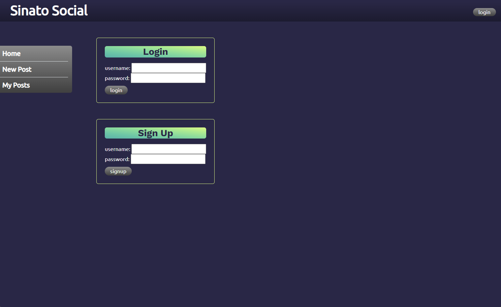
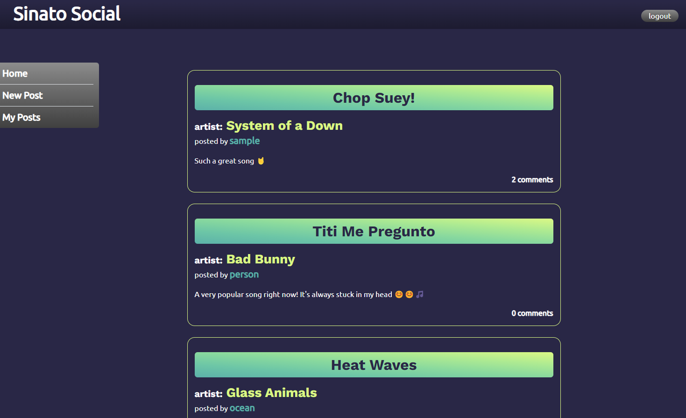

# Sinato Social

## Description
This application is a social media site for music. Users can post about what song they're listening to and a caption on their thoughts. Others can add to the conversation by posting comments and using emojis. Made with Express servers and sessions, this is a great place for music lovers!

## Built With
* Express 
* Express sessions
* JavaScript
* Node.js
* Bcrypt
* MySQL
* Sequelize
* Bootstrap
* CSS
* Handlebars.js
* Emoji One Area.js

## Installation
Installation instructions are only needed if you want to clone this project locally. To do this you will need:
* An IDE with terminal or terminal
* MySQL powershell

Once the project is cloned locally set up the enviornment variables in a .env file with the database name as 'sinato_db' and run the following command:  
>  npm i   

Then from the MySQL powershell terminal run: 
> source db/schema.sql

## Usage
To see this project [click here]()

## Collaborators
[Ocean](https://github.com/oceanlatte): Express sessions and styling  
[Bryan](https://github.com/bryannolasco11): Sequelize models and fixing bugs  
[Stephanie](https://github.com/strossouw): JavaScript logic and Emoji picker  
[Ian](https://github.com/TheTrueZK): Handlebars.js and styling  
